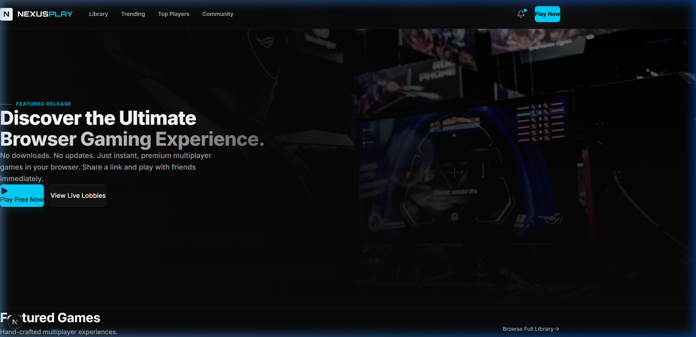
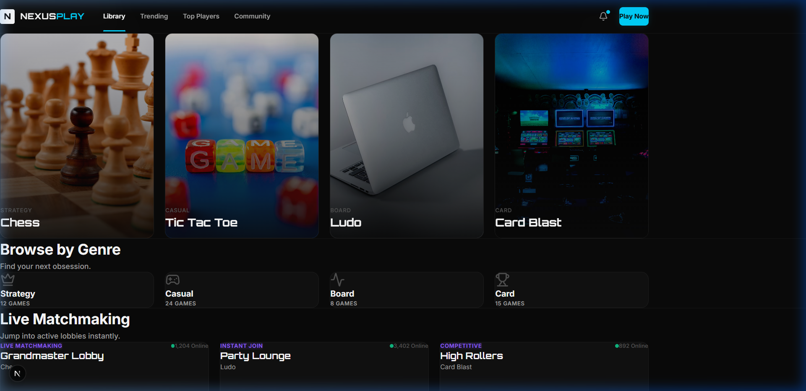
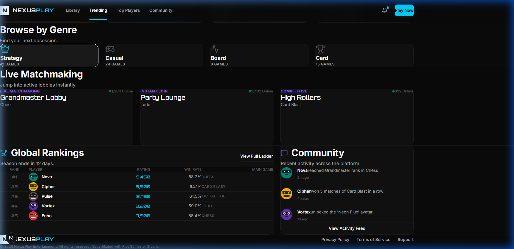

# NexusPlay — Premium Browser Gaming Platform

NexusPlay is a state-of-the-art, AAA-quality browser gaming client designed to deliver instant, frictionless multiplayer experiences directly in your browser. Built with a focus on premium aesthetics, flawless grid layouts, and immersive micro-interactions, NexusPlay rivals native desktop software like Steam, Discord, and Riot Games.

No downloads. No updates. Just share a link and play instantly.

---

## 📸 Platform Previews

### Cinematic Hero & Global Navigation
The platform operates on a single-page hierarchy with a completely fixed, frosted-glass 72px navigation bar.
<br/>


### Premium Game Library
Games are showcased in an asymmetrical responsive grid with hover-revealed meta details and live player counts.
<br/>


### Global Rankings & Community Feed
Real-time matchmaking statistics, ranked ladders, and a scrolling community feed keep the platform active and engaging.
<br/>


---

## 🛠 Tech Stack

NexusPlay is engineered using the latest modern web technologies for maximum performance and fluid animations:

### Core Architecture
- **Framework**: [Next.js 15 (App Router)](https://nextjs.org/)
- **Language**: [TypeScript](https://www.typescriptlang.org/)
- **Monorepo Management**: [Turborepo](https://turbo.build/)
- **Package Manager**: [npm Workspace](https://docs.npmjs.com/cli/v7/using-npm/workspaces)

### Design & UI
- **Styling**: [Tailwind CSS v4](https://tailwindcss.com/)
- **Component System**: Custom highly-tailored UI built on [shadcn/ui](https://ui.shadcn.com/) foundations
- **Animations**: [Framer Motion](https://www.framer.com/motion/)
- **Icons**: [Lucide React](https://lucide.dev/)
- **Typography**: Inter (sans-serif) & Outfit (display/gaming headers)

### Multiplayer & Backend (Coming Soon)
- **Real-Time Engine**: [Colyseus](https://colyseus.io/)
- **State Synchronization**: WebSocket + Delta Encoding
- **Database**: PostgreSQL / Prisma

---

## ✨ Key Features

- **Single Page Hierarchy**: The entire platform is a cohesive, smooth-scrolling experience without disjointed page unloads.
- **Strict 8-Point Layout Grid**: Flawless responsive design engineered around an 8-point system (128px sections, 32px headers, 24px gaps).
- **Glassmorphism & Cyber-Aesthetics**: Elegant use of `backdrop-blur`, animated gradients, and high-contrast neon highlights (cyan/purple/blue).
- **Zero-Overlap Architecture**: Elements are precisely constrained within flex/grid layouts. No text clipping, no broken rows.
- **Cinematic Interactions**: Micro-animations on hover (scaling, brightness adjustments, overlay reveals) that make the platform feel alive.

---

## 🚀 Getting Started

To run the Next.js development server locally:

```bash
# Clone the repository
git clone https://github.com/your-username/gamestore.git

# Install dependencies
npm install

# Start the Turborepo development server
npm run dev
```

The application will be available at [http://localhost:3000](http://localhost:3000).

---

*Designed and developed as a premium multiplayer experience. Not affiliated with Riot Games or Steam.*
